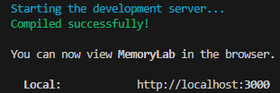
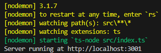

# MemoryLab

A drag-and-drop application for visualizing Python memory models, designed for use in computer science education. Students can build memory models by arranging blocks that represent variables, objects, functions, and values on a canvas, and submit their models for feedback.

## Features

- **Scratch-style canvas** - drag-and-drop blocks onto a canvas to create or edit a memory model
- **Question bank for practice**
  - _Build from code_: construct a full memory model diagram from a given Python snippet
  - _Fill-in-the-blanks_: complete partially-built models to test specific concepts
- **Custom questions** - paste your own Python code to practice new exercises
- **Automatic grading and visual feedback** - submit a model and get detailed feedback about correctness
- **Checkpoint validation** - insert checkpoints in questions to verify your work incrementally
- **Export to JSON** - download your completed model as a JSON file ready for MarkUs submission

## Developer Instructions

For developers, follow these steps to set up and run the development environment:

### 1. Clone the repo

```bash
git clone https://github.com/YOUR_USERNAME/memory-model-editor.git
cd memory-model-editor
```

### 2. Install frontend dependencies and start frontend server

```bash
cd frontend
npm install
npm run dev
```

You should see the frontend being run on `http://localhost:3000` in the terminal. You need to open this link in your browser.



### 3. Install backend dependencies and start backend server

```bash
cd backend
npm install
npm run dev
```

You should see the backend being run on `http://localhost:3001` in the terminal. You do not need to open this link in your browser.


