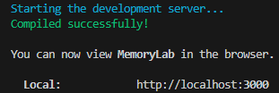
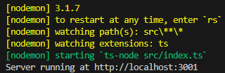

# MemoryLab

A drag-and-drop application for visualizing Python memory models, designed for use in computer science education. Students can build memory models by arranging blocks that represent variables, objects, functions, and values on a canvas, and submit their models for feedback.

## Features

### Interactive Canvas

A Scratch-style canvas for visualizing Python memory models. Users can build diagrams by dragging and dropping blocks that represent frames, objects, and values.

### Practice vs. Test Modes

MemoryLab is designed to support different learning styles. Users can switch between two distinct modes to match your needs for a given exercise.

- **Practice Mode**: A guided environment that provides a more structured experience with a limited options to assist with model construction.

- **Test Mode**: A free-form environment with no constraints, allowing for independent model creation and self-assessment.

### Practice Question Bank

MemoryLab includes a built-in library of exercises for practice. The question bank currently contains two kinds of questions.

- **Practice questions**: questions drawn from previous first year computer science courses at the University of Toronto.
- **Test Questions**: questions drawn from tests from previous first year computer science courses at the University of Toronto.

### Automatic Grading & Feedback

After a model has been constructed, it can be submitted for automatic grading. The system provides detailed, traceable feedback on a dedicated tab, helping you understand where your model can be improved.

### Export & Download Options

Once a model is complete, you can save and export it. The canvas allows for downloads in multiple formats for submission on platforms like Markus or for other uses.

- **JSON**: To save your model as a file that can be re-imported into MemoryLab.

- **SVG**: For a high-quality, scalable vector image.

- **PNG**: For a standard image file.

## Developer Instructions

For developers, follow these steps to set up and run the development environment:

### 1. Clone the repo

```bash
git clone https://github.com/YOUR_USERNAME/memory-model-editor.git
cd memory-model-editor
```

### 2. Set up the database

#### Install PostgreSQL

macOS:

```bash
brew install postgresql@17
brew services start postgresql@17
```

Ubuntu/Debian:

```bash
sudo apt update
sudo apt install postgresql postgresql-contrib
sudo systemctl start postgresql
```

Windows:
Download and install from [postgresql.org](https://www.postgresql.org/download/)

#### Create the database

```bash
# Connect to PostgreSQL
psql postgres

# Create the database
CREATE DATABASE memorylab;
\q
```

#### Import the schema

```bash
# From the project root
psql -d memorylab < backend/database/schema.sql
```

#### Configure environment variables

```bash
cd backend
cp .env.example .env
```

Update the `.env` file with your database connection string:

```
DATABASE_URL=postgresql://your_username@localhost:5432/memorylab
```

Replace `your_username` with your PostgreSQL username (often your system username on macOS/Linux, or `postgres` on Windows).

### 3. Install frontend dependencies and start frontend server

```bash
cd frontend
npm install
npm run dev
```

You should see the frontend being run on `http://localhost:3000` in the terminal. You need to open this link in your browser.



### 4. Install backend dependencies and start backend server

```bash
cd backend
npm install
npm run dev
```

You should see the backend being run on `http://localhost:3001` in the terminal. You do not need to open this link in your browser.



### 5. Adding Questions to the Database

The application uses two question tables:

- `practice_questions`: Questions for practice mode
- `test_questions`: Questions for test mode

#### Connecting to the Database

```bash
psql -d memorylab
```

#### Adding a Practice Question

```sql
INSERT INTO practice_questions (question, code, answer, description)
VALUES (
    'Your question text here',
    ARRAY['line 1 of code', 'line 2 of code', 'line 3 of code'],
    '[{"id": 1, "type": "int", "value": 5}]'::jsonb,
    'Optional description'
);
```

#### Adding a Test Question

```sql
INSERT INTO test_questions (question, code, answer, description)
VALUES (
    'Your question text here',
    ARRAY['line 1 of code', 'line 2 of code'],
    '[{"id": null, "name": "__main__", "type": ".frame", "order": 1, "value": {"a": 1}}]'::jsonb,
    '2024 midterm 1'
);
```

#### Answer Format

The `answer` field is a JSON array representing the memory model. Each element can be:

Frame:

```json
{
    "id": null,
    "name": "__main__",
    "type": ".frame",
    "order": 1,
    "value": {"variable_name": id_reference}
}
```

Primitive (int, str, bool):

```json
{
  "id": 1,
  "type": "int",
  "value": 5
}
```

List:

```json
{
  "id": 2,
  "type": "list",
  "value": [1, 2, 3]
}
```

Object:

```json
{
    "id": 3,
    "name": "ClassName",
    "type": "object",
    "value": {"attribute": id_reference}
}
```

#### Viewing Existing Questions

```sql
-- View all practice questions
SELECT id, question FROM practice_questions;

-- View a specific question with full details
SELECT * FROM practice_questions WHERE id = 1;

-- View all test questions
SELECT id, question, description FROM test_questions;
```

#### Updating a Question

```sql
UPDATE practice_questions
SET answer = '[{"id": 1, "type": "int", "value": 10}]'::jsonb
WHERE id = 1;
```

#### Deleting a Question

```sql
DELETE FROM practice_questions WHERE id = 1;
```

## Production Deployment

### Building for Production

Before deploying to production, you need to compile the TypeScript code to JavaScript.

#### Backend

```bash
cd backend
npm run build
npm start
```

- `npm run build` - Compiles TypeScript files from `src/` into JavaScript files in the `dist/` directory
- `npm start` - Runs the compiled JavaScript code

#### Frontend

```bash
cd frontend
npm run build
npm start
```

- `npm run build` - Creates an optimized production build
- `npm start` - Runs the production server

## Technical Details

### Validation Function

The validation function, located in backend/src/modules/canvasEditor/validateAnswer.ts, is a core component for evaluating user submissions in the memory model editor. It operates by treating the validation task as a graph-isomorphism problem. The goal is to determine if the user's canvas, representing a directed graph, is structurally identical to the correct answer's graph.

#### Graph Representation

- **Nodes**: Each unique "box" in the memory model (e.g., a primitive, a list, or a function frame) is a node.

- **Edges**: A reference from one box to another—whether by variable name (in a frame) or by ID (in a container like a list)—forms a directed edge.

The function's primary objective is to find a single, consistent bijection (a one-to-one mapping) between the IDs of the user's boxes and the IDs of the answer's boxes. This mapping, if found, proves the two graphs are structurally equivalent.

#### Core Algorithm

The validation process follows a hierarchical and recursive approach, starting from the top-level frames and traversing down through all referenced boxes. The process maintains two maps, answerToInputMap and inputToAnswerMap, to keep track of the ID bijection and prevent circular references.

1. **Top-Level Checks** (`validateAnswer`)

   The `validateAnswer` function checks if a user's submitted answer is correct by comparing it to a stored answer. It first retrieves the correct solution from a database based on the provided question ID. It then performs a series of checks on the user's input, including scanning for duplicate IDs and validating the structure of the function frames. After these preliminary checks, it begins a detailed, recursive comparison of the graph-like structure of the user's submission against the correct answer to ensure they are identical.

2. **Frame and Variable Comparison** (`compareFrames`)

   The `compareFrames` function compares function frames between the correct answer and the user's submission. It loops through each frame and checks for missing variables or unexpected variables. If a variable is found in both frames, the function proceeds to a deeper, recursive comparison of the linked boxes by calling the compareIds function.

3. **Recursive ID Comparison** (`compareIds`)

   The `comapreIds` function takes an answer ID and a user ID and performs a series of checks:

   - **Unmapped ID Lookup**: It verifies that both the answer ID and user ID correspond to an existing box in their respective models.

   - **Bijection Enforcement**: It checks if the current ID mapping conflicts with any previously established mappings. If a conflict is found, it's a critical error.

   - **Type Verification**: It confirms that the type of the user's box matches the type of the answer's box (e.g., list vs. int).

   - **Primitive Value Check**: If the boxes are primitive types (int, str, bool), it performs a direct value comparison.

   - **Container Comparison**: If the boxes are containers (list, set, dict), it recursively calls compareIds on their contained elements.

   To prevent infinite loops in cases of circular references (e.g., a list referencing itself), it uses a visited map to track pairs of IDs that have already been checked.

4. **Container-Specific Logic**

   Different container types are handled with specific logic:

   - **Arrays** (`checkArray`): The function checks for missing elements and unexpected elements based on length. It then performs a direct, order-sensitive comparison of each element.

   - **Sets** (`checkSet`): Since sets are unordered, the function attempts to find a match for each element in the answer set within the user's set. It performs a "tentative" recursive comparison, and if no errors are found, it considers the elements a match.

   - **Dictionaries** (`checkDict`): The function checks for missing keys and unexpected keys. For shared keys, it recursively compares the values (IDs) of the key-value pairs.

   - **Objects** (`checkObject`): Objects represent instances with named properties. The function verifies that object names match exactly, checks for missing or unexpected properties, and recursively compares the IDs referenced by each property. Object-specific error messages indicate issues like missing properties or name mismatches.

5. **Final Checks**

   After the recursive traversal is complete, the function performs final checks:

   - **Call Stack Order** (`checkCallStackOrder`): If the frames are correctly named, it verifies that their order matches the expected call stack.

   - **Orphan Detection** (`detectOrphans`): It identifies any user boxes that are not referenced by any variables or containers, flagging them as "unmapped boxes."

   The function returns a boolean correct status and a list of all detected errors. This provides detailed feedback on the submission's correctness and the specific areas that need fixing.
